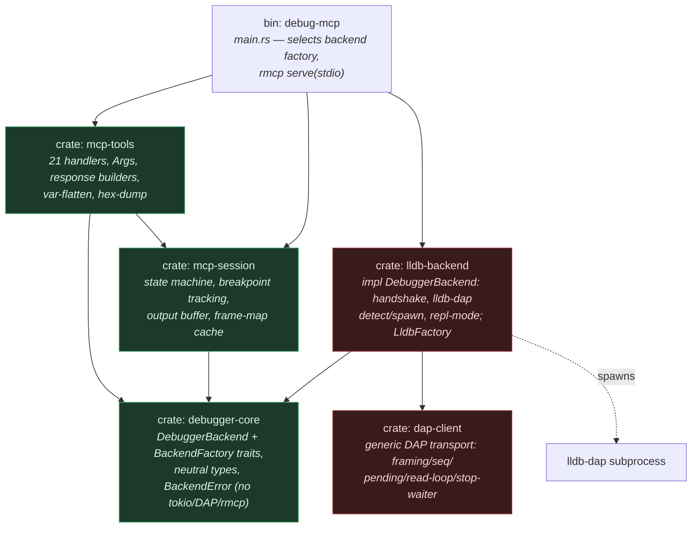
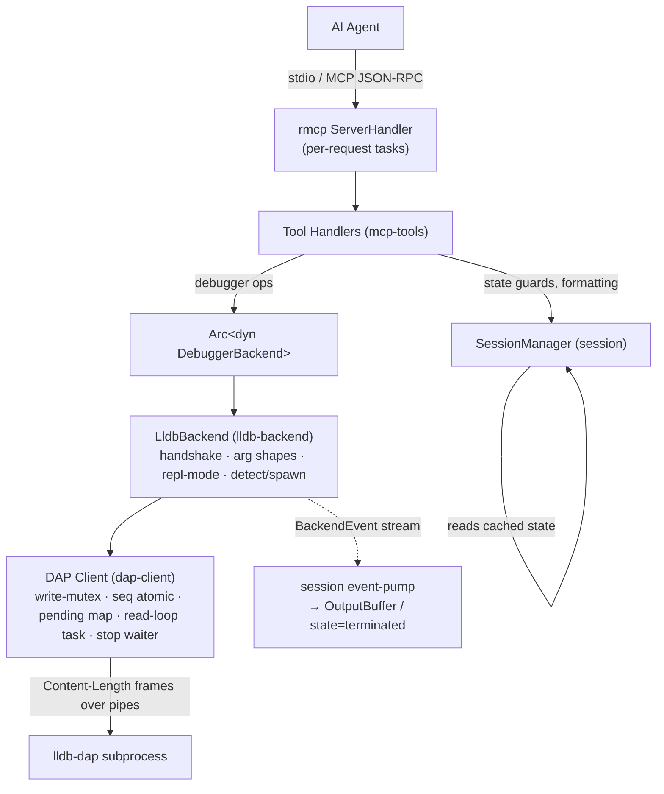
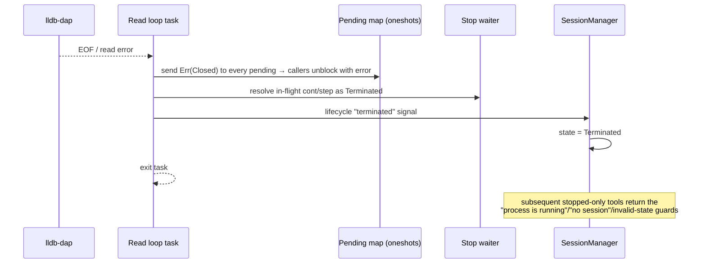
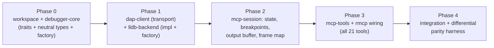

# Rust Rewrite — Technical Design

## Overview

This document is the technical design for re-implementing the Go `lldb-debug-mcp`
server in Rust — shipping as the **`debug-mcp`** binary — satisfying
[`Specs/RustPort`](../../Specs/RustPort/README.md). The Rust server is
**behaviorally feature-identical** to the Go server (same 21 MCP tools, defaults,
response shapes, error strings, state machine, DAP handshake) and introduces a
`DebuggerBackend` seam so a future WinDbg backend can be added without touching the
tool layer. Only the lldb-dap/DAP backend is implemented here.

The design translates the Go concurrency model (goroutines + channels + a worker
pool) into idiomatic async Rust (`tokio` tasks + channels + interior mutability),
preserves every observable behavior the spec enumerates, and physically enforces the
backend seam with a Cargo **workspace** so the tool/session crates cannot reach DAP
types.

Key references from the spec carried into this design: structural JSON parity (not
byte-for-byte); favor *intent* over literal transcription for language artifacts
(Spec Appendix A); `disassemble` default `instruction_count = 20` (Spec OQ-1
resolved); backend payloads are opaque pass-through (Spec OQ-2 resolved).

## Architecture

### Workspace layout (the seam, enforced by crate boundaries)



**Six crates, fully isolated, pluggable from the start.** The split is deliberate:
the *contract* (`debugger-core`), the *generic DAP transport* (`dap-client`), and the
*lldb-specific backend* (`lldb-backend`) are three distinct crates so that (a) the
neutral app logic never sees DAP, and (b) a second DAP-speaking debugger reuses
`dap-client` while a non-DAP debugger (WinDbg) ignores it entirely.

**Seam guarantee:** `mcp-tools` and `mcp-session` depend on `debugger-core` only —
they cannot name a DAP type, a `dap-client` type, or anything lldb-specific. Only the
`bin` crate depends on a concrete backend crate (`lldb-backend`), and only to obtain a
`Box<dyn BackendFactory>`. Everything the app touches is `Arc<dyn DebuggerBackend>` /
`dyn BackendFactory`. Adding WinDbg = new `windbg-backend` crate implementing the same
two traits + one registration line in `bin` — **zero** changes above the seam, and no
dependency on `dap-client`.

| Crate | Kind | Role | May depend on |
|-------|------|------|---------------|
| `debugger-core` | contract | `DebuggerBackend` + `BackendFactory` traits, neutral types, `BackendEvent`, `BackendError`, `Granularity`, `EvalMode`, outcomes | leaf — `std`, `serde`, `async-trait`, `futures` (Stream). **No `tokio`/`rmcp`/DAP** |
| `dap-client` | common transport | generic DAP wire client: Content-Length framing, seq, pending map, read-loop, stop-waiter, the ~20 DAP message types used | `tokio`, `serde`, `serde_json` |
| `lldb-backend` | backend (lldb) | `LldbBackend: DebuggerBackend` + `LldbFactory: BackendFactory`; the launch/attach handshake, lldb-dap arg shapes, `detect`, `subprocess`, repl-mode/backtick — built on `dap-client` | `debugger-core`, `dap-client`, `tokio`, `serde` |
| `mcp-session` | common | `SessionManager`: state machine, breakpoint tracking, frame-map cache, `OutputBuffer`; owns `Arc<dyn DebuggerBackend>` | `debugger-core`, `tokio` (channels) |
| `mcp-tools` | common | the 21 handlers, `Args` accessor, response builders, `flatten_variables`, `format_hex_dump`, `format_output_entries` | `debugger-core`, `mcp-session`, `rmcp` |
| `debug-mcp` | binary | `main`: register backend factory(ies), wire session/tools, rmcp `serve(stdio())` | all of the above |

Crates live under `crates/`; the workspace root keeps the existing `testdata/` and a
top-level `Cargo.toml` `[workspace]`. The published binary is renamed
`lldb-debug-mcp` → **`debug-mcp`** — it is no longer lldb-specific, so the `lldb`
prefix is reserved for the genuinely lldb-bound pieces (`lldb-backend`, `LldbBackend`,
`LldbFactory`, and lldb-dap detection). The advertised MCP **server name** is likewise
renamed `"lldb-debug"` → **`"debug"`** (Spec FR-1.1, an intentional deviation from the
Go oracle reflecting backend pluggability). The DAP-handshake `clientID` we send *to*
lldb-dap stays `"lldb-debug-mcp"` (below the seam, lldb-dap-facing).

### Layered runtime view



### Async/task model

- **Runtime:** `#[tokio::main]` (multi-threaded). Subprocess via `tokio::process`.
- **DAP Client internals** (inside `dap-client`, below the seam):
  - **Writer:** an `async` write guarded by a `tokio::sync::Mutex` (serializes frame
    writes), or a dedicated writer task fed by an `mpsc` — either is acceptable; the
    mutex is simplest and matches Go's `writeMu`.
  - **Sequence:** `AtomicI64`, pre-increment, first seq `1` (Spec FR-17.2).
  - **Pending map:** `Mutex<HashMap<i64, oneshot::Sender<Result<DapMessage,BackendError>>>>`
    keyed by request seq; each waiter is a `oneshot` (capacity-1 ⇒ dispatch never
    blocks). Correlation by the response's `request_seq`.
  - **Read loop:** one `tokio::task` reading framed messages and dispatching by type
    (Spec FR-17.6). On EOF/read error it performs the recovery sequence (Spec
    FR-17.7): fail all pending oneshots, resolve any in-flight stop waiter as
    `Terminated`, send the lifecycle "terminated" signal, then exit.
  - **Stop waiter:** a single-slot `Mutex<Option<oneshot::Sender<StopOutcome>>>`,
    registered **before** the resume request is written (Spec FR-8.3 / FR-17.8).
  - **Event stream:** the read loop's `OutputEvent`/`TerminatedEvent`/EOF are adapted
    by `lldb-backend` into a neutral `BackendEvent` stream on the `Connection`. The
    session's event-pump task drains it (output → `OutputBuffer`; `Terminated{code}` →
    record exit code + state `terminated`, generation-guarded) — Go's `SetOutputHandler`
    + `onExit`/`onTerminated`, expressed as one runtime-neutral stream.
- **Cancellation:** each tool handler receives rmcp's request `CancellationToken`.
  Blocking calls (`launch`, `attach`, `continue`, `step_*`) are awaited with
  `tokio::select!` against the token; on cancel they return the corresponding Go
  timeout string. Dropping an in-flight DAP request future removes its pending entry
  via an **`AbortGuard`** (Drop impl), mirroring Go's `ctx.Done()` cleanup.

### Interfaces

#### The `DebuggerBackend` trait (refines Spec FR-18)

The trait is **coarse-grained and blocking** for execution/lifecycle: methods that
resume the target return the **next stop**. This puts the DAP handshake and the
`InitializedEvent`-ordering quirk entirely below the seam (Spec FR-18.4) and matches
the Go tools' blocking design. (This concrete trait supersedes the *indicative*
sketch in Spec FR-18.7, which is explicitly non-normative.)

```rust
// crate `debugger-core` — neutral types, no DAP/rmcp/tokio.

pub enum Granularity { Line, Instruction }
pub enum EvalMode { Expression, Repl }   // Repl ⇒ backtick decision lives in the backend

pub struct StopInfo {
    pub reason: String,            // opaque pass-through: "breakpoint","exception","signal","step",…
    pub thread_id: i64,
    pub description: String,
    pub hit_breakpoint_ids: Vec<i64>,
}
/// Outcome of any operation that resumes the target.
pub enum StopOutcome { Stopped(StopInfo), Exited { code: Option<i64> }, Terminated }

pub struct LaunchSpec {
    pub program: String, pub args: Vec<String>, pub cwd: Option<String>,
    pub env: Vec<(String,String)>, pub stop_on_entry: bool,
    pub source_breakpoints: Vec<(String, Vec<SourceBp>)>,   // flushed during config
    pub function_breakpoints: Vec<FunctionBp>,
}
pub enum LaunchOutcome { Stopped(StopInfo), Running, Exited { code: Option<i64> } }
pub struct AttachSpec { pub pid: Option<i64>, pub wait_for: Option<String> }
// attach can produce "Process exited during attach" (Go attach.go:220), so it
// returns an outcome, not a bare StopInfo. No `Running` variant: attach is always stop-on-entry.
pub enum AttachOutcome { Stopped(StopInfo), Exited { code: Option<i64> }, Terminated }

pub struct Frame { pub index: i64, pub id: i64, pub name: String,
                   pub source_path: Option<String>, pub line: i64,
                   pub instruction_pointer: Option<String> }
pub struct ThreadInfo { pub id: i64, pub name: String }
pub struct Scope { pub name: String, pub variables_reference: i64 }
pub struct Variable { pub name: String, pub value: String, pub ty: String,
                      pub variables_reference: i64, pub named: i64, pub indexed: i64 }
pub struct BreakpointResult { pub id: i64, pub verified: bool, pub line: i64, pub message: String }
pub struct EvalResult { pub result: String, pub ty: String, pub variables_reference: i64 }
pub struct MemoryRead { pub address: String, pub data: Vec<u8> }   // address = backend's echoed address
pub struct Instruction { pub address: String, pub instruction: String, pub bytes: String,
                         pub symbol: String, pub source_path: Option<String>, pub line: i64 }

#[async_trait::async_trait]
pub trait DebuggerBackend: Send + Sync {
    // lifecycle — own the full handshake below the seam
    async fn launch(&self, spec: LaunchSpec) -> Result<LaunchOutcome, BackendError>;
    async fn attach(&self, spec: AttachSpec) -> Result<AttachOutcome, BackendError>;
    async fn disconnect(&self, terminate: bool); // best-effort, never errors (Spec FR-6)

    // breakpoints (used while stopped)
    async fn set_source_breakpoints(&self, file: &str, bps: &[SourceBp]) -> Result<Vec<BreakpointResult>, BackendError>;
    async fn set_function_breakpoints(&self, bps: &[FunctionBp]) -> Result<Vec<BreakpointResult>, BackendError>;

    // execution — block until the next stop
    async fn cont(&self, thread_id: i64) -> Result<StopOutcome, BackendError>;
    async fn step(&self, kind: StepKind, thread_id: i64, gran: Option<Granularity>) -> Result<StopOutcome, BackendError>;
    async fn pause(&self) -> Result<(), BackendError>; // returns immediately; unblocks an in-flight cont/step

    // inspection
    async fn threads(&self) -> Result<Vec<ThreadInfo>, BackendError>;
    async fn stack_trace(&self, thread_id: i64, start: i64, levels: i64) -> Result<(Vec<Frame>, i64), BackendError>; // (frames, total); `start` is always 0 from current callers
    // NOTE: there is intentionally no `set_exception_breakpoints` on the trait — each backend's
    // launch/attach sends empty exception filters internally (matches Go). Promote it to the trait
    // only when a backend needs caller-controlled exception-filter configuration (e.g. WinDbg).
    async fn scopes(&self, frame_id: i64) -> Result<Vec<Scope>, BackendError>;
    async fn variables(&self, variables_reference: i64) -> Result<Vec<Variable>, BackendError>;
    async fn evaluate(&self, expr: &str, frame_id: Option<i64>, mode: EvalMode) -> Result<EvalResult, BackendError>;
    async fn read_memory(&self, address: &str, count: i64) -> Result<MemoryRead, BackendError>;
    async fn disassemble(&self, address: &str, count: i64) -> Result<Vec<Instruction>, BackendError>;

    // capability
    fn supports_command_repl_mode(&self) -> bool;
}

// --- Pluggability: the binary registers factories; the session asks one to connect. ---
pub enum BackendEvent {                 // async, runtime-neutral (carried over futures::Stream)
    Output { category: String, text: String },
    Terminated { code: Option<i64> },   // async death (crash/EOF) — drives state → terminated
}
pub struct Connection {
    pub backend: Arc<dyn DebuggerBackend>,
    pub events: futures::stream::BoxStream<'static, BackendEvent>,
}
#[async_trait::async_trait]
pub trait BackendFactory: Send + Sync {
    fn name(&self) -> &'static str;     // e.g. "lldb"
    /// Detect + spawn + start the transport; returns a *not-yet-launched* backend plus
    /// its event stream. Maps to Go's lazy lldb-dap spawn at launch/attach time.
    async fn connect(&self) -> Result<Connection, BackendError>;
}
```

**Cancellation crosses the seam at the tool layer, not inside the trait.** The trait
signatures take **no** `CancellationToken` (the `backend` crate must not depend on
`tokio`/`tokio-util`). Instead, a blocking handler wraps the call:

```rust
tokio::select! {
    r = backend.cont(tid)        => map_stop_outcome(r),
    _ = req.ct.cancelled()       => err_text("continue timed out; process still running, use 'pause' to stop it"),
}
```

On cancellation the backend future is **dropped**, which must be cancel-safe:
- the in-flight DAP request is removed from the pending map by an `AbortGuard`
  (`Drop`), mirroring Go's `ctx.Done()` cleanup (`client.go:88`);
- the stop-waiter slot is self-healing — the next `Register()` replaces any orphaned
  sender (Go `StopWaiter::Register` does the same);
- session state is left as `running` (the handler set it before awaiting and does not
  revert on cancel) — this is exactly Go's behavior (`execution.go:57-59`); the agent
  recovers with `pause`.

`pause` runs concurrently with a blocked `cont` because every method takes `&self`
over interior-mutable state and no session lock is held across the await (Decision 7).

**Construction & wiring.** `bin/main.rs` builds the chosen `Box<dyn BackendFactory>`
(today `lldb_backend::LldbFactory::new()`) and injects it into the server alongside
`Arc<SessionManager>`. The factory is **not** invoked at startup. On `launch`/`attach`
(lazy spawn, Spec FR-1.6) the tool handler calls `factory.connect()` →
`Connection { backend, events }`; it stores `backend` in the session, bumps the
session generation, and spawns an **event-pump task** draining `events`:
`Output{category,text}` → append to the `OutputBuffer`; `Terminated{code}` → record
exit code + set state `terminated` (generation-guarded). It then calls
`backend.launch(spec)` / `backend.attach(spec)`. A `connect()` failure surfaces as
`BackendError::Detect`/`Spawn`, which the handler formats into
`failed to find lldb-dap: …` / `failed to spawn lldb-dap: …` and resets the session.
`disconnect` calls `backend.disconnect(terminate)`, drops the backend (killing the
subprocess and ending the pump), and resets — the next `launch` connects a fresh
backend (session reuse, Spec FR-6).

#### `LldbBackend` implementation notes (below the seam — load-bearing for parity)

These details live inside `lldb-backend` (orchestration over `dap-client`) and are
easy to get subtly wrong:

- **Stop-waiter placement asymmetry.** `launch` registers the stop waiter **before**
  `configurationDone` (Go `launch.go:304`, guarding the immediate stop-on-entry event
  against a race); `attach` registers it **after** `configurationDone` (Go
  `attach.go:219`). Reproduce both placements as-is — do **not** swap them.
- **`run_command` ↔ `evaluate(EvalMode::Repl)`.** The `run_command` tool handler
  passes the **raw** command string to `evaluate(cmd, None, EvalMode::Repl)` —
  unmodified. The `LldbBackend` is the only place that prepends `` ` `` (when
  `!self.supports_command_repl_mode()`) and sends `context="repl"`. The handler then
  builds `{"result","type"}` and **discards** `variables_reference` (no `has_children`
  key), unlike `evaluate` which adds it (Go `run_command.go:56-59` vs `inspection.go`).
  `evaluate` uses `EvalMode::Expression` (`context="variables"`) with a real `frame_id`.
- **Implicit frame resolution.** `resolveFrameID` (in `mcp-tools`) calls
  `stack_trace(thread_id, start=0, levels=20)` on a frame-map miss — always `levels=20`,
  regardless of any user-supplied `backtrace` `levels` (Go `inspection.go:35`).
- **`set_exception_breakpoints`** is sent with empty filters inside both `launch` and
  `attach`, after the breakpoint flush and before `configurationDone` (Spec FR-4.4.11).

#### MCP tool surface (rmcp)

- The server type holds `Arc<SessionManager>` and a `Box<dyn BackendFactory>` (the
  session holds the *connected* `Arc<dyn DebuggerBackend>` for the active session).
- Tools are registered with **hand-built input schemas** that match the Go mcp-go
  schemas exactly (string/number/boolean, `required`, `enum`, descriptions). Handlers
  receive the **raw arguments object** and parse via the `Args` accessor (see Decision
  3) — they do not rely on serde to deserialize a typed struct.
- Handlers return a `CallToolResult`: success = one text content holding a JSON object
  string (`CallToolResult::success(vec![Content::text(json)])`); error =
  `CallToolResult::error(vec![Content::text(msg)])` (`is_error=true`). This matches
  Go's `NewToolResultText` / `NewToolResultError` shape exactly.

#### `SessionManager` (neutral, in `session`)

Mirrors the Go session manager (Spec FR-4, FR-7, FR-12) with one `RwLock`-guarded
inner state plus a separately-locked `OutputBuffer`:

```rust
struct Inner {
    state: State,                                  // Idle|Configuring|Stopped|Running|Terminated
    generation: u64,                               // bumped on Reset()/disconnect — see race note
    program: String, pid: i64, exit_code: Option<i64>,
    last_stopped: Option<StopInfo>,
    frame_mapping: HashMap<i64, i64>,              // frame index → frame id
    source_bps: HashMap<String, Vec<SourceBp>>,
    function_bps: Vec<FunctionBp>,
    bp_responses: HashMap<i64, BreakpointInfo>,    // by debugger-assigned id
    pending_source_bps: HashMap<String, Vec<SourceBp>>,
    pending_function_bps: Vec<FunctionBp>,
}
// The Go `replModeCommand` flag is NOT tracked here: the coarse trait moves the
// backtick decision into the backend (`supports_command_repl_mode()`), so there is no
// session-level repl flag to keep in sync.
pub struct SessionManager {
    inner: RwLock<Inner>,
    output: Mutex<OutputBuffer>,                    // evict oldest while size > 1_048_576 (strict >);
                                                    // size counts len(category)+len(text); "[output truncated]" marker on drain
    backend: RwLock<Option<Arc<dyn DebuggerBackend>>>,
}
```

`check_state(allowed)` returns the exact Spec FR-4.2 strings. `frame_mapping` is
returned **by clone** (the Go live-map aliasing is incidental — Spec Appendix A).
Breakpoint getters clone (defensive copy) as in Go. `function_bps`/`pending_function_bps`
are plain `Vec` (the Go `nil`-vs-empty distinction is incidental).

**Disconnect-vs-in-flight-tool race.** Unlike Go's worker pool (which serializes most
calls), Rust dispatches tool handlers concurrently, so a `disconnect` can land while a
blocked `continue` is awaiting its `StopOutcome`. The `generation` counter resolves
this: a blocking handler snapshots `generation` before awaiting the backend; after the
call returns it re-acquires the write lock and applies its state transition **only if
`generation` is unchanged**. `disconnect`/`Reset()` bump `generation`, so a `continue`
that returns after a concurrent `disconnect` finds a stale generation and returns
without clobbering the reset `idle` state. (`pause` and `status` do not mutate state,
so they are unaffected; this guard is only for the `running → stopped/terminated`
transition.)

## Design Decisions

### Decision 1: Six-crate workspace with a backend-factory seam, isolated from the start

**Context:** The product directive is "proper crate isolation from the start: one for
the main binary, a crate for lldb, and common crates — pluggable architecture from the
start." The seam must be compiler-enforced (not a convention an implementer can bypass
by importing a DAP type into a tool), and adding a second backend (WinDbg) must be
additive, not a refactor.

**Options Considered:**
1. Single crate, modules only.
2. Minimal workspace: one `backend` crate (trait + DAP impl together) + `session` +
   `tools` + `bin`.
3. **Full isolation:** separate the *contract* (`debugger-core`), the *generic DAP
   transport* (`dap-client`), and the *lldb backend* (`lldb-backend`); plus
   `mcp-session`, `mcp-tools`, and the `debug-mcp` binary — six crates — with a
   `BackendFactory` trait so the binary selects/registers backends rather than
   constructing one inline.

**Decision:** Full isolation (option 3).

**Rationale:** This is the structure the directive asks for and it pays off three ways.
(1) **Enforced neutrality:** `mcp-tools`/`mcp-session` depend only on `debugger-core`,
so DAP and lldb types are *unnameable* above the seam — the strongest possible proof of
the Spec FR-18 / AC "no DAP types leak above the seam." (2) **Reuse:** factoring the
generic DAP transport (`dap-client`) out of the lldb specifics means a future
DAP-speaking backend (e.g. a `gdb-dap`) reuses the transport and most of the handshake,
while a non-DAP backend (WinDbg) takes no dependency on it. (3) **Additive
pluggability:** a `BackendFactory` (in `debugger-core`) is the single injection point;
the binary registers `LldbFactory` today, and a `WinDbgFactory` later, with no change
above the seam and no inline backend construction. The cost — a handful of
`Cargo.toml`s — is negligible for a ~10k-LOC project, and the boundaries also speed
incremental compiles and let each crate's tests run in isolation. Backend *selection*
is compile-time/default (lldb is the only registered factory), so runtime behavior and
the Spec FR-1.5 "only `LLDB_DAP_PATH`" constraint are preserved; a runtime selector
(env/feature) is a trivial later addition that would update FR-1.5 at that time.

### Decision 2: Coarse-grained, blocking backend trait (execution returns the next stop)

**Context:** Go's DAP handshake has version-dependent `InitializedEvent` ordering and
a stop-waiter race; the spec mandates these DAP quirks live below the seam (FR-18.4).
A fine-grained trait (separate `initialize`/`launch`/`configuration_done`/…) would
leak the handshake shape and the stop-wait race-handling above the seam.

**Options Considered:**
1. Fine-grained trait; tool layer orchestrates the handshake and owns the stop waiter
   (closest to Go's literal structure).
2. Coarse trait: `launch`/`attach` run the entire handshake internally; `cont`/`step`
   block and return `StopOutcome`; the stop waiter is internal to the backend.

**Decision:** Coarse, blocking trait (option 2).

**Rationale:** It keeps everything DAP-specific (framing, seq, the dual-await of
launch-response + `InitializedEvent`, exception-breakpoint quirk, configurationDone,
`--repl-mode`) below the seam, exactly as FR-18.4 requires, and it is what a WinDbg
backend can actually satisfy (every engine can "run to next stop"). The session/tools
layer keeps only debugger-neutral concerns (state machine, breakpoint *tracking*,
frame-map cache, output buffer). Behavior is identical: the tool sets `running` before
the call and `stopped`/`terminated` after, from the returned `StopOutcome` — the same
transitions Go performs in `handleStopResult`. Pending breakpoints are passed into
`LaunchSpec` (the session flushes its pending buffer into the spec), preserving "launch
flushes, attach does not" (Spec FR-4.4.10 / FR-5.5).

### Decision 3: Explicit tool schemas + a raw-`Args` accessor (not the `#[tool]` macro)

**Context:** Parity requires (a) exact validation error strings
(`'pid' must be a number`, `'args' must be a JSON array string, …`,
`missing required parameter: …`), (b) Go's permissive numeric handling (JSON numbers
→ `float64` → `int`), and (c) `args`/`env` delivered as **JSON-in-a-string**. rmcp's
`#[tool]` macro deserializes arguments into a typed struct via serde and generates the
schema from it; serde's "missing/!type" errors surface as protocol `invalid_params`,
not as Go's tool-error strings.

**Options Considered:**
1. `#[tool]` macro + typed `Parameters<P>` structs; accept serde's errors.
2. Macro for schema, but parse permissively in the body from `Option<Value>` fields.
3. Hand-built input schemas (JSON literals matching Go) + handlers receive the raw
   `serde_json::Map` through an `Args` accessor that reproduces mcp-go's
   `RequireString`/`GetString`/`GetBool`/`GetInt`/`GetArguments` semantics and exact
   error text.

**Decision:** Option 3.

**Rationale:** The advertised schema and the runtime parsing have different parity
requirements, so decouple them. The schemas are small and fully enumerated by the
spec; writing them as `serde_json::json!` literals is direct and exact. The `Args`
accessor centralizes the float64 coercion, the JSON-string `args`/`env` handling, and
every custom error string in one tested module, so all 21 handlers reproduce Go's
behavior verbatim. rmcp still owns transport, routing, and `CallToolResult` plumbing.
(If a future maintainer relaxes schema-parity, the macro becomes viable; the `Args`
layer stays.)

### Decision 4: `tokio` translation of the Go concurrency primitives

**Context:** Go uses goroutines, `chan`, `sync.Mutex`/`RWMutex`, a buffered(1)
stop-waiter channel, and a `pending map[int]chan`. These must become idiomatic,
race-free Rust without changing observable behavior (Spec Appendix A marks them
incidental).

**Options Considered:**
1. Thread-based (`std::thread` + `std::sync`) to mirror Go literally.
2. `tokio` async: read-loop task, write `Mutex`, `AtomicI64` seq, `oneshot` pending +
   stop waiter, `mpsc` output, `watch` lifecycle.

**Decision:** `tokio` async (option 2).

**Rationale:** rmcp is async-first; an async DAP client composes naturally with rmcp's
request handling and with `tokio::select!` for cancellation. The mapping is direct and
faithful: `pending map[int]chan` → `HashMap<i64, oneshot::Sender>`; buffered(1)
stop-waiter → single-slot `oneshot`; read-loop goroutine → read task; `writeMu` →
write `Mutex`; `cancelAllPending` → drain the pending map sending `Err`. Cancel-safety
for in-flight requests is handled by an `AbortGuard` whose `Drop` removes the pending
entry (mirrors Go's `ctx.Done()` delete). The user runs sanitizers/`-race`-equivalents
in CI; Rust's type system plus `cargo test` under the thread sanitizer (available)
covers the concurrency that Go validated with `-race`.

### Decision 5: One neutral `BackendEvent` stream (push), not pull or callbacks

**Context:** Output events arrive at unpredictable times during a run; the buffer must
accumulate continuously and be drained at stops and via `read_output`. Crash/EOF must
flip state to `terminated` even when no execution call is in flight (Go's
`onTerminated`). The contract crate must stay runtime-neutral (no `tokio` types in its
public API).

**Options Considered:**
1. Pull model: session polls the backend for output.
2. Two tokio channels (an `mpsc` for output + a `watch` for lifecycle) returned from
   `connect()`.
3. A single neutral `BackendEvent` stream (`futures::Stream`) on the `Connection`,
   carrying `Output{category,text}` and `Terminated{code}`, drained by a session
   event-pump task.

**Decision:** Single neutral event stream (option 3).

**Rationale:** It matches Go's callback-driven append (`SetOutputHandler`) and
`onExit`/`onTerminated` exactly while keeping the contract crate free of `tokio` types
(`futures::Stream` is runtime-agnostic — `lldb-backend` builds the stream from a tokio
`mpsc` internally and boxes it). The `OutputBuffer` (1 MiB cap, strict-`>` FIFO
eviction, `[output truncated]` marker) stays entirely in the neutral `mcp-session`
crate; the backend emits neutral chunks and a terminated signal with **no** buffering
policy below the seam. One stream (vs two channels) is also simpler for a WinDbg
backend to produce.

### Decision 6: Response building with `serde_json::Map` + conditional inserts

**Context:** Go builds `map[string]any` and relies on `omitempty`/conditional inserts;
`encoding/json` emits keys sorted. Parity is structural (Spec FR-3.6).

**Options Considered:**
1. Typed response structs with `#[serde(skip_serializing_if = "…")]`.
2. Build a `serde_json::Map` and insert keys conditionally, then serialize to a string.

**Decision:** Option 2 (a small `RespBuilder` helper), with typed structs only where
a fixed shape is natural (e.g. `FlatVariable`).

**Rationale:** Go's responses are dynamic maps with many conditional keys (e.g.
`status` differs per state; frames add `file`/`line`/`address` only when present). A
`serde_json::Map` builder mirrors that one-to-one and is easy to verify against the Go
handler line-by-line. Bonus: serde_json's default `Map` is sorted (BTree), so output
key order *coincidentally* matches Go's sorted map output — near-byte parity for free,
though only structural parity is required. `FlatVariable` uses a typed struct with
`skip_serializing_if` to reproduce the `type`/`has_children`/`children_count`
omitempty rules (Spec FR-11.2).

### Decision 7: Concurrency for `pause`-during-`continue`

**Context:** Spec FR-1.7 requires `pause` (and `status`) to run while `continue`/
`step_*` is blocked. Go gets this from mcp-go's worker pool.

**Options Considered:**
1. Assume rmcp dispatches each request on its own task (concurrent handlers).
2. Spawn the blocking backend call onto a detached task and return a handle (defeats
   the simple blocking model).

**Decision:** Rely on concurrent per-request handler dispatch (option 1), and make it
safe by construction: backend methods take `&self`; handlers acquire the session
`RwLock` only briefly (never held across an `await`), and the execution handler holds
**no** lock while awaiting the `StopOutcome`.

**Rationale:** Because the backend is `&self` + interior-mutable and the write path is
a short-held `Mutex`, a `pause()` call writes a `PauseRequest` while `cont()`'s future
is parked on its stop `oneshot`; the resulting `StoppedEvent` resolves `cont()`. The
only rule is "don't hold the session lock across `.await`," which the handler structure
enforces. **Verification (design risk):** confirm rmcp processes concurrent
`tools/call` requests rather than serializing them; if it serializes, switch the
execution handlers to spawn-and-await with the request token. Tracked in
[Open risks](#open-risks).

### Decision 8: Test layout in dedicated folders; in-memory pipe fakes

**Context:** The Go suite uses pipe-backed fakes (`fakeVarServer`, mock readers) and a
build-tagged integration suite. Project convention is to keep Rust tests in dedicated
`tests/` (and `src/tests/`) folders rather than inline `#[cfg(test)]` modules.

**Decision:** Per-crate `tests/` integration-style tests plus `src/tests/` for
unit-level tests that need crate internals; DAP client tests drive a fake adapter over
`tokio::io::duplex()` (in-memory bidirectional pipe) mirroring the Go pipe fakes;
the real-lldb-dap suite sits behind a Cargo feature `integration` (analog of the Go
`//go:build integration` tag) and reuses the existing `testdata/*.c` fixtures + Makefile.

**Rationale:** Matches the project's test-placement convention and the Go test
architecture, so each Go test maps to a Rust counterpart. `tokio::io::duplex` gives the
same "talk to a scripted peer over a pipe" capability the Go tests used, enabling
deterministic read-loop / correlation / stop-waiter / framing tests without a real
debugger.

## Error Handling

**Layering.** `BackendError` (in `backend`) is the single error type the trait returns:
variants for `Spawn`, `Detect`, `Send`, `Protocol(unexpected type)`, `Dap{message}`
(a `success=false` response), `Closed` (read loop terminated / EOF), and `Timeout`.
Tool handlers map `BackendError` into the **exact Go strings** at each call site (e.g.
`continue request failed: <e>`, `unexpected initialize response type: <t>`,
`setBreakpoints failed: <msg>`). The mapping table is enumerated in the spec (FR-4…FR-14);
the handler is the only place these literals appear.

**Domain vs transport.** Every domain/operational failure (bad state, missing param,
DAP error) is returned as a `CallToolResult` with `is_error=true` — never as an rmcp
protocol error (Spec FR-3.2). The handler return type is `CallToolResult` (infallible
at the rmcp boundary); internal `Result`s are mapped before returning.

**Crash / EOF recovery** (Spec FR-17.7): the read loop in `dap-client` performs the
unblock sequence; `lldb-backend` adapts it into a `BackendEvent::Terminated`:



**Disconnect** (Spec FR-6): best-effort `DisconnectRequest` under a 5 s bound (errors
ignored), then close stdin and wait up to 5 s for graceful exit, else kill; always
returns `{"status":"disconnected"}` and resets the session to idle.

**Cancellation** maps to the Go timeout strings: `launch timed out: …`,
`timed out waiting for stop on entry: …`, `attach timed out: …`,
`continue timed out; process still running, use 'pause' to stop it`, and the per-step
variants — produced when the request `CancellationToken` fires before the backend
future resolves.

## Testing Strategy

**Parity-by-mirroring.** Every Go test gets a Rust counterpart pinning the same
behavior. Suites by crate:

- `debugger-core` — neutral type round-trips (the enums/outcomes); the trait itself is
  exercised through `lldb-backend`.
- `dap-client` (driven over `tokio::io::duplex` scripted-peer fakes):
  - **framing** round-trip + malformed-input errors (truncated body, invalid JSON, no
    `Content-Length`, empty) — mirror `types_test.go`.
  - **client** send/await, concurrent sends with reversed-order responses, context
    cancellation cleanup, `cancel_all_pending`, `next_seq` 1..N, dispatch-no-waiter
    (no panic) — mirror `client_test.go`.
  - **read loop** per-event dispatch (stopped/output/initialized/exited/terminated;
    informational events logged only), EOF recovery (all pending err + stop waiter
    terminated) — mirror the `TestReadLoop*` set.
  - **stop waiter** deliver/exit/cancel/no-waiter/concurrent — mirror `stopwaiter_test.go`.
  - **`AbortGuard` + oneshot-send-on-dropped-receiver** no-op behavior (R5).
- `lldb-backend`:
  - **detect** order (env → lldb-dap → lldb-dap-20..15 → lldb-vscode → macOS xcrun),
    versioned-prefers-higher, not-found lists candidates — mirror `detect_test.go`.
  - **subprocess** stderr 4 KB ring (basic/overflow/multi-write/concurrent/default
    size), spawn echo round-trip, exit detection, `--repl-mode=command` only when
    capable — mirror `subprocess_test.go`.
  - **handshake** (over a scripted DAP peer on `tokio::io::duplex`): launch/attach
    ordering incl. order-independent `InitializedEvent`, launch-flushes-but-attach-
    doesn't, the stop-waiter placement asymmetry, arg serialization (omitempty),
    repl-mode/backtick, and DAP→neutral-type translation.
- `mcp-session` — state transitions + `check_state` messages; breakpoint add/remove/list
  (id-sorted) / pending flush (idempotent) / source-by-line + function-by-name removal
  / defensive-copy getters; `OutputBuffer` append/drain/truncation/concurrency —
  mirror `session_test.go`.
- `mcp-tools` — `Args` accessor (required/missing/typed-coercion/JSON-string
  `args`/`env`); `flatten_variables` (all `variables_util_test.go` vectors: basic,
  filter top-level-only + case-insensitive, has-children-at-depth-0,
  recursive/deep/depth-limit, truncation incl. mid-recursion, children-count
  named+indexed, empty/no-match); `format_hex_dump` (full/partial/multi/empty exact
  bytes); `format_output_entries` (empty/grouping/omit-missing); per-tool state-guard
  rejections and missing-parameter cases for all 21 tools; `FlatVariable` JSON
  omitempty — mirror the `*_test.go` set under `internal/tools`.
  - **stop-result formatting with a seeded `OutputBuffer`** — verifies that drained
    output entries are merged into the `stopped`/`exited` response JSON and that the
    `[output truncated]` marker surfaces correctly (the Go `handleStopResult` merge
    path, normally only hit by the integration suite).
- **integration** (Cargo feature `integration`, reuse `testdata/*.c` + Makefile):
  process exit + exit code 0; stdout capture (`hello from simple`); crash/signal stop
  with a backtrace frame at `crash.c:7`; lldb-dap crash recovery (kill → terminated →
  relaunch); crash during a blocked `continue` returns within bound (no hang); the full
  13-step end-to-end workflow (breakpoints at `loop.c:6` and `:9`, continue, backtrace
  finds `main`, variables include `i`/`sum`, three step-overs, evaluate `i + 1`,
  `run_command register read`, second breakpoint hit within 20 continues, remove first,
  list shows 1, continue to exit 0) — mirror `integration_test.go`.

**Differential parity harness (recommended).** A small test rig that runs the same MCP
tool sequence against the Go binary and the Rust binary and compares the parsed JSON
results field-by-field (structural). This catches drift the per-test mirrors miss and
operationalizes "feature-identical." Runs in the `integration` feature.

### Structural Verification

Per `shared/languages/rust.md` and project conventions:

- **`cargo clippy --all-targets --all-features -- -D warnings`** on every phase.
  Warnings are fixed at the source — **no `#[allow]` suppressions** and clippy is not
  considered clean merely because a local cached build is quiet.
- **`cargo fmt --check`** — formatting gate.
- **`cargo test --workspace`** green; **`cargo test --workspace --features integration`**
  green where lldb-dap + fixtures are available.
- **`cargo test` under ThreadSanitizer** (`-Z sanitizer=thread`, nightly) for the
  `dap-client` concurrency tests — the Rust analog of Go's `-race` (sanitizers are
  available in the dev sandbox). Miri only if any `unsafe` is introduced; the design
  targets **zero `unsafe`** (DAP framing and all buffers are safe), so miri is expected
  to be N/A.
- No tool/`#[allow]` is used to silence a real finding; if clippy flags something,
  the code changes.

## Migration / Rollout

Greenfield rewrite; the Go binary is the parity oracle and stays runnable throughout.



1. **Phase 0 — Seam.** Workspace scaffolding; `debugger-core` crate (`DebuggerBackend`
   + `BackendFactory` traits, neutral types, `BackendEvent`, `BackendError`). Compiles
   against a stub factory; no behavior yet.
2. **Phase 1 — Transport + lldb backend.** `dap-client` (framing, seq, pending, read
   loop, stop waiter, the DAP message types used), then `lldb-backend` (`detect`,
   `subprocess`, the launch/attach handshake + arg shapes + repl-mode, `LldbBackend` +
   `LldbFactory`). Validated by the `dap-client` and `lldb-backend` unit suites over
   `tokio::io::duplex` + a couple of live smoke tests.
3. **Phase 2 — Session.** Port `SessionManager` (state machine, breakpoint tracking,
   output buffer, frame-map cache, event-pump). Validated by the `mcp-session` suite.
4. **Phase 3 — Tools + server.** `Args` accessor, response builders,
   `flatten_variables`/`format_hex_dump`/`format_output_entries`, all 21 handlers,
   hand-built schemas, rmcp `serve(stdio())`. Validated by the `mcp-tools` suite.
5. **Phase 4 — Integration & parity.** Port the integration suite; build the
   differential harness; run both binaries against `testdata/*.c`.

**Repository placement.** Develop the Rust workspace alongside the Go tree (e.g. a
`rust/` subtree or a dedicated branch) until parity is demonstrated, then make the
Rust binary the published artifact. The MCP client `command` path changes
(`/path/to/lldb-debug-mcp` → `/path/to/debug-mcp`, optional `LLDB_DAP_PATH`
unchanged) and the advertised server name changes (`lldb-debug` → `debug`); the
**tool surface stays identical**, so once the path and server-name key are updated,
existing agent workflows keep working.

**Rollback.** Until Phase 4 passes the differential harness, the Go binary remains the
shipping artifact; the Rust binary is opt-in. No data migration exists (stateless
server).

## Open Risks

- **R1 — rmcp concurrent dispatch (Decision 7).** Must confirm rmcp runs `tools/call`
  handlers concurrently so `pause` can interrupt a blocked `continue`. Mitigation:
  spawn-and-await the backend call if rmcp serializes. *Verify in Phase 3.*
- **R2 — rmcp manual schema/registration API.** Decision 3 needs rmcp's manual tool
  registration (custom `input_schema` + raw-args handler). If only the `#[tool]` macro
  path is ergonomic, fall back to macro-for-schema + `Args`-for-parsing (Decision 3,
  option 2). *Verify in Phase 3 against the rmcp version pinned in `Cargo.toml`.*
- **R3 — DAP type source.** Decide between an existing DAP types crate and locally
  defined `serde` structs (in `dap-client`) for the messages used. Local structs avoid
  a dependency and guarantee wire-shape control; a crate saves typing. *Resolve in
  Phase 1* (leaning local structs for the ~20 message types actually used).
- **R4 — `disassemble` default (Spec OQ-1).** Design uses **20** (documented intent).
  If strict Go-code parity (10) is later chosen, it is a one-line change plus its test.
- **R5 — `AbortGuard` cancel-safety.** The pending-entry-removing `Drop` guard is a new
  pattern (not in the Go code). It must be `Send`, must **not** hold the pending-map
  lock when `Drop` runs (acquire it inside `Drop`, briefly), and must tolerate the
  entry already being gone (idempotent delete — `cancelAllPending` may have drained it
  on EOF). Likewise, the stop-waiter `oneshot::Sender::send` returns `Err` when the
  receiver was dropped (cancelled future); that `Err` is silently discarded — the
  correct no-op, matching Go's "no waiter ⇒ no-op." *Cover both in `dap-client` tests.*

## Appendix — Go → Rust module map

All crates live under `crates/`.

| Go | Rust crate::module |
|----|--------------------|
| `cmd/lldb-debug-mcp/main.go` | `debug-mcp/src/main.rs` (registers `LldbFactory`) |
| `internal/tools/tools.go` (registration) | `mcp-tools/src/server.rs` (schemas + router) |
| `internal/tools/{launch,attach,disconnect}.go` | `mcp-tools/src/handlers/lifecycle.rs` |
| `internal/tools/{breakpoints,execution}.go` | `mcp-tools/src/handlers/{breakpoints,execution}.rs` |
| `internal/tools/{inspection,memory,output,run_command}.go` | `mcp-tools/src/handlers/{inspection,memory,output,run_command}.rs` |
| `internal/tools/variables_util.go` | `mcp-tools/src/flatten.rs` |
| `internal/tools/output.go` (`formatOutputEntries`), `memory.go` (`formatHexDump`) | `mcp-tools/src/format.rs` |
| `internal/session/session.go` | `mcp-session/src/lib.rs` (+ `output_buffer.rs`, `pump.rs`) |
| `internal/dap/{client,stopwaiter,types}.go` | `dap-client/src/{client,stop_waiter,wire}.rs` |
| `internal/detect/{detect,subprocess}.go` | `lldb-backend/src/{detect,subprocess}.rs` |
| launch/attach handshake (Go `tools/{launch,attach}.go` DAP steps) | `lldb-backend/src/handshake.rs` |
| (new) `DebuggerBackend` + `BackendFactory` traits, neutral types | `debugger-core/src/lib.rs` |
| (new) `LldbBackend` impl + `LldbFactory` | `lldb-backend/src/{backend,factory}.rs` |
| (future) WinDbg | `windbg-backend/` (new crate; impl the same two traits) |
