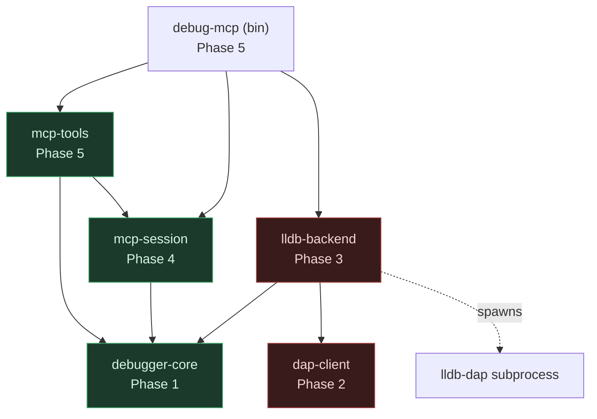
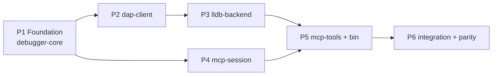

# Rust Rewrite — debug-mcp

## Overview

Implement the Rust rewrite of the Go `lldb-debug-mcp` server, shipping as the
**`debug-mcp`** binary, per the approved [`Specs/RustPort`](../../Specs/RustPort/README.md)
and [`Designs/RustPort`](../../Designs/RustPort/README.md). The deliverable is a
behaviorally feature-identical MCP debugging server (21 tools, same defaults, response
shapes, error strings, state machine, DAP handshake) built on a `DebuggerBackend` seam
so a future WinDbg backend plugs in without touching the tool layer. Only the
lldb-dap/DAP backend is implemented.

The plan delivers, phase by phase: the neutral contract crate → the generic DAP
transport → the lldb backend → the session manager → the 21 tools + rmcp server →
integration tests and a differential parity harness against the Go binary.

**Two intentional deviations from the Go oracle** (both recorded in the spec's Resolved
Decisions and enforced by tests): the server identity rename (`lldb-debug-mcp`→`debug-mcp`
binary, `lldb-debug`→`debug` MCP server name) and `disassemble` default
`instruction_count` = **20** (documented intent; Go code uses 10). Everything else is
strict behavioral parity.

## Architecture

Six fully-isolated crates in a Cargo workspace; the seam is compiler-enforced
(`mcp-tools`/`mcp-session` depend only on the neutral `debugger-core`, never on DAP or
lldb types). See the design for full rationale.

Phases 2/3 (below-seam transport + backend) and Phase 4 (session) both depend only on
Phase 1 and may proceed in parallel; Phase 5 joins them.

## Key Decisions

Carried from the approved design (see `Designs/RustPort` Design Decisions 1–8):

1. **Six-crate workspace with a `BackendFactory` seam** — `debugger-core`, `dap-client`,
   `lldb-backend`, `mcp-session`, `mcp-tools`, `debug-mcp` (bin). Compiler-enforced
   neutrality; adding WinDbg = new crate + one registration line.
2. **Coarse, blocking `DebuggerBackend` trait** — `launch`/`attach` run the whole DAP
   handshake internally; `cont`/`step` block and return the next `StopOutcome`. All DAP
   quirks (InitializedEvent ordering, stop-waiter race) stay below the seam.
3. **Explicit tool schemas + raw-`Args` accessor** (not the `#[tool]` macro) — to
   reproduce Go's exact validation error strings and permissive numeric/JSON-string handling.
4. **tokio translation** — read-loop task, write `Mutex`, `AtomicI64` seq, `oneshot`
   pending map + stop waiter, single neutral `BackendEvent` stream, `AbortGuard`
   cancel-safety; cancellation lives in the tool handler via `tokio::select!`.
5. **`serde_json::Map` response builders** with conditional inserts (structural JSON
   parity; sorted keys ≈ Go's output for free).
6. **Session `generation` epoch** guards the `running → stopped/terminated` transition
   against a concurrent `disconnect` (Rust dispatches tool calls concurrently).
7. **Tests in dedicated `tests/`/`src/tests/` folders**; `tokio::io::duplex` scripted-peer
   fakes for transport/backend tests; `clippy -D warnings` with **no `#[allow]`**;
   ThreadSanitizer for `dap-client` concurrency.

## Dependencies

- `rmcp` (Rust MCP SDK — server, stdio transport, tool registration).
- `serde` / `serde_json`; `tokio` (runtime, process, sync); `async-trait`; `futures`
  (runtime-neutral `Stream` in `debugger-core`).
- A DAP types source — local `serde` structs in `dap-client` (leaning) or an existing
  crate (resolve in Phase 2; design risk R3).
- Runtime: `lldb-dap` (LLVM 18+) or `lldb-vscode`. Build: `gcc`/`clang` for fixtures.
- The Go binary stays buildable as the parity oracle for the Phase 6 differential harness.
- Open design risks to resolve during implementation: R1 (rmcp concurrent dispatch),
  R2 (rmcp manual schema API), R3 (DAP type source), R5 (`AbortGuard` cancel-safety).
