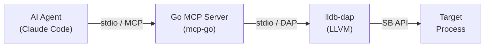
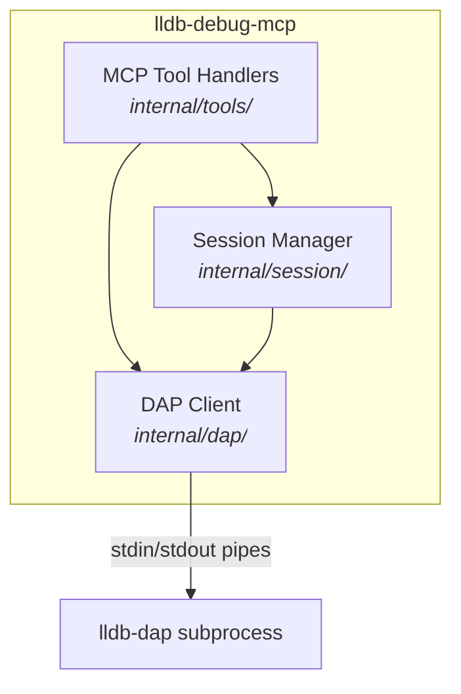
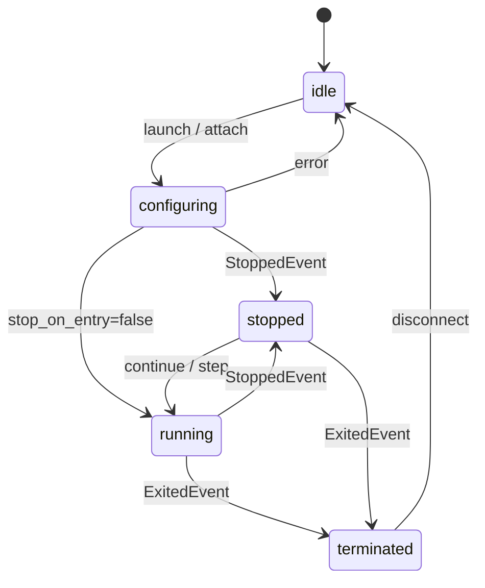
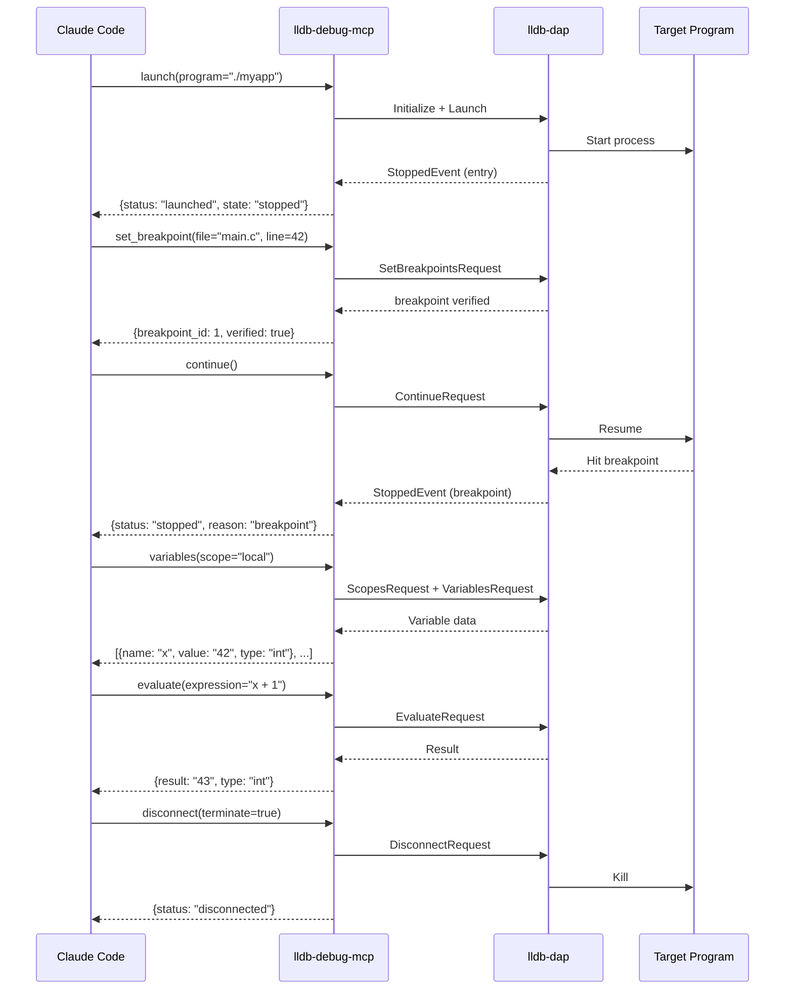

# lldb-debug-mcp

An MCP (Model Context Protocol) server that gives AI agents interactive LLDB debugging capabilities. Built in Go, it spawns `lldb-dap` as a subprocess and communicates via the Debug Adapter Protocol over stdio pipes.

## Architecture



The server has three internal layers:



| Layer | Responsibility |
|-------|---------------|
| **Tool Handlers** | Parameter validation, state guards, JSON response formatting |
| **Session Manager** | State machine, breakpoint tracking, output buffering, frame mapping |
| **DAP Client** | Content-Length framing, request/response correlation, async event dispatch |

### Session State Machine



## Requirements

- Go 1.22+
- `lldb-dap` (or `lldb-vscode`) binary

### Installing lldb-dap

| Platform | Command |
|----------|---------|
| macOS | `xcode-select --install` |
| Ubuntu / Debian | `sudo apt install lldb` |
| Fedora | `sudo dnf install lldb` |
| Arch Linux | `sudo pacman -S lldb` |

The server auto-detects the binary using this fallback chain:

1. `LLDB_DAP_PATH` environment variable
2. `lldb-dap` in PATH
3. `lldb-dap-{20..15}` in PATH (versioned)
4. `lldb-vscode` in PATH (older LLVM)
5. macOS only: `xcrun --find lldb-dap`

Set `LLDB_DAP_PATH` if auto-detection doesn't find it.

## Installation

```bash
go install github.com/danweinerdev/lldb-debug-mcp/cmd/lldb-debug-mcp@latest
```

Or build from source:

```bash
go build -o lldb-debug-mcp ./cmd/lldb-debug-mcp
```

## How to Use with Claude Code

### 1. Configure the MCP server

Run this from your terminal:

```bash
claude mcp add lldb-debug -- /path/to/lldb-debug-mcp
```

Or add it manually to your MCP settings (`.claude/settings.json` or project-level):

```json
{
  "mcpServers": {
    "lldb-debug": {
      "command": "/path/to/lldb-debug-mcp"
    }
  }
}
```

If `lldb-dap` isn't on your PATH, pass the environment variable:

```json
{
  "mcpServers": {
    "lldb-debug": {
      "command": "/path/to/lldb-debug-mcp",
      "env": {
        "LLDB_DAP_PATH": "/usr/lib/llvm-18/bin/lldb-dap"
      }
    }
  }
}
```

### 2. Compile your program with debug info

The target binary must be compiled with debug symbols. For C/C++:

```bash
gcc -g -O0 -o myprogram myprogram.c
# or
clang -g -O0 -o myprogram myprogram.c
```

For Rust: `cargo build` (debug profile includes symbols by default).

### 3. Ask Claude to debug

Once configured, Claude Code can use the debugging tools directly. Example prompts:

- *"Launch `./myprogram` and set a breakpoint at main.c line 42, then continue and show me the local variables when it hits"*
- *"Debug the segfault in `./crash_repro` — find where it crashes and inspect the state"*
- *"Attach to PID 12345 and get a backtrace of all threads"*
- *"Step through the loop in process_data() and watch how the buffer variable changes"*

### Typical debugging workflow



### Tips

- **Breakpoints before launch**: You can set breakpoints before calling `launch` — they are buffered and sent automatically during the DAP handshake.
- **`run_command` escape hatch**: If a structured tool doesn't cover your use case, `run_command` executes any LLDB command directly (e.g., `run_command(command="watchpoint set variable x")`).
- **Concurrent pause**: While `continue` is blocking, you can call `pause` from a separate tool call to interrupt execution.
- **Output capture**: Program stdout/stderr is buffered and included in `continue`/`step_*` responses. Use `read_output` to drain any additional output.

## Claude Desktop

Add to `~/Library/Application Support/Claude/claude_desktop_config.json` (macOS) or `%APPDATA%/Claude/claude_desktop_config.json` (Windows):

```json
{
  "mcpServers": {
    "lldb-debug": {
      "command": "/path/to/lldb-debug-mcp"
    }
  }
}
```

## Tools Reference

### Session Management

| Tool | Description | Parameters |
|------|-------------|------------|
| `launch` | Launch a program under the debugger | `program` (required), `args`, `cwd`, `env`, `stop_on_entry` |
| `attach` | Attach to a running process | `pid` or `wait_for` |
| `disconnect` | End the debug session | `terminate` (default true) |

### Breakpoints

| Tool | Description | Parameters |
|------|-------------|------------|
| `set_breakpoint` | Set a source-line breakpoint | `file` (required), `line` (required), `condition` |
| `set_function_breakpoint` | Break on function entry | `name` (required), `condition` |
| `remove_breakpoint` | Remove a breakpoint | `breakpoint_id` (required) |
| `list_breakpoints` | List all breakpoints | — |

### Execution Control

| Tool | Description | Parameters |
|------|-------------|------------|
| `continue` | Resume execution (blocks until next stop) | `thread_id` |
| `step_over` | Step over current line | `thread_id`, `granularity` (line/instruction) |
| `step_into` | Step into function call | `thread_id`, `granularity` (line/instruction) |
| `step_out` | Step out of current function | `thread_id` |
| `pause` | Pause all threads | — |

### Inspection

| Tool | Description | Parameters |
|------|-------------|------------|
| `status` | Session state and stop info | — |
| `backtrace` | Call stack for a thread | `thread_id`, `levels` |
| `threads` | List all threads | — |
| `variables` | Variables in scope (recursive flattening) | `frame_index`, `scope` (local/global/register), `depth`, `filter` |
| `evaluate` | Evaluate an expression | `expression` (required), `frame_index` |
| `read_output` | Drain captured stdout/stderr | — |

### Advanced

| Tool | Description | Parameters |
|------|-------------|------------|
| `read_memory` | Read raw memory (hex dump) | `address` (required), `count` (required) |
| `disassemble` | Disassemble at address or PC | `address`, `instruction_count` |
| `run_command` | Execute any LLDB command | `command` (required) |

## Development

```bash
# Run unit tests
go test -race ./...

# Run integration tests (requires lldb-dap + compiled fixtures)
make -C testdata
go test -tags integration -race ./internal/tools/ -v

# Build
go build -o lldb-debug-mcp ./cmd/lldb-debug-mcp
```

## License

MIT
