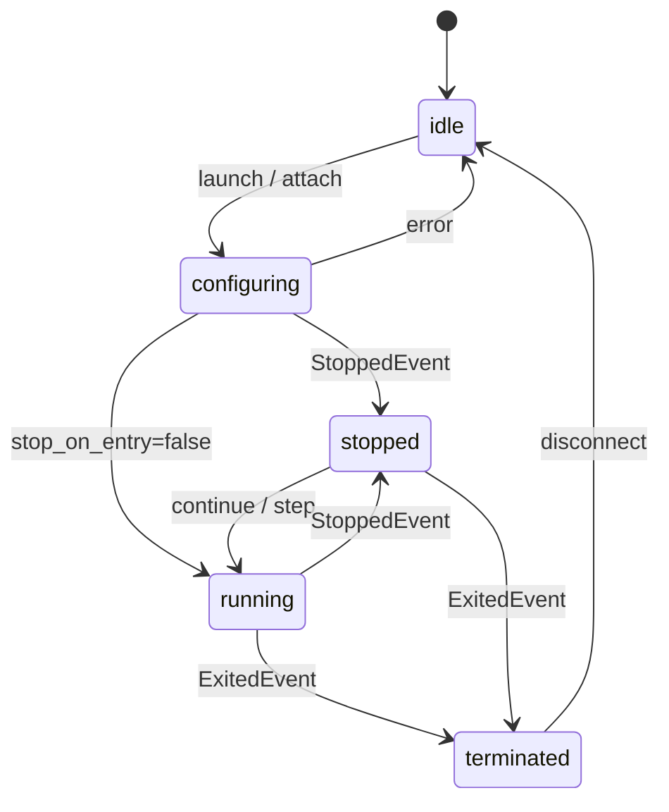

# debug-mcp

An MCP (Model Context Protocol) server that gives AI agents interactive debugging
capabilities. This is the Rust port of `lldb-debug-mcp`, built on the official Rust MCP
SDK ([`rmcp`](https://crates.io/crates/rmcp)). It is **behaviorally feature-identical** to
the Go version — the same 21 tools, parameters, defaults, session state machine, DAP
handshake, response shapes, and error semantics — with two intentional, documented
deviations (see [Intentional deviations](#intentional-deviations)).

The motivation for the rewrite is a **pluggable debugger backend**: the tool and session
layers depend on a debugger-neutral `DebuggerBackend` trait, so a future backend (e.g.
WinDbg) can be added without touching the MCP tool layer. Today the only backend is
`lldb-dap`, driven over the Debug Adapter Protocol (DAP) on stdio.

> **Binary name `debug-mcp`, server name `debug`.** The published binary is `debug-mcp`
> and the advertised MCP server name is `debug` (the Go version used `lldb-debug-mcp` /
> `lldb-debug`). Backends are now pluggable, so the `lldb` prefix is reserved for the
> genuinely lldb-bound pieces (the lldb backend crate and lldb-dap detection). MCP clients
> that namespace tools by server name should use `debug`.

## Architecture

```mermaid
graph LR
    Agent["AI Agent<br/>(Claude Code)"] -->|stdio / MCP (rmcp)| Server["Rust MCP Server<br/>(debug-mcp)"]
    Server -->|stdio / DAP| LLDB["lldb-dap<br/>(LLVM)"]
    LLDB -->|SB API| Target["Target<br/>Process"]
```

The server is a Cargo workspace of six crates, split along the `DebuggerBackend` seam so
the tool/session crates cannot reach DAP- or lldb-specific code:

| Crate | Role | Notes |
|-------|------|-------|
| `debugger-core` | contract | `DebuggerBackend` + `BackendFactory` traits, neutral types, `BackendEvent`, `BackendError`. Leaf crate — **no** `tokio`/`rmcp`/DAP dependency. |
| `dap-client` | generic DAP transport | Content-Length framing, sequence correlation, the pending-request map, the read loop, the stop waiter. |
| `lldb-backend` | lldb backend | `LldbBackend` (the launch/attach handshake, lldb-dap arg shapes, repl-mode/backtick) + `LldbFactory` (detect → spawn → connect). Built on `dap-client`. |
| `mcp-session` | session | `SessionManager`: state machine, breakpoint tracking, frame-map cache, output buffer. Depends only on `debugger-core`. |
| `mcp-tools` | tool layer | the 21 handlers, `Args` accessor, response builders, `flatten_variables`, hex-dump/output formatters, the rmcp `ServerHandler`. Depends only on `debugger-core` + `mcp-session` (+ `rmcp`). |
| `debug-mcp` | binary | `main`: wire the session + the `LldbFactory` into the `ToolServer`, serve over stdio via rmcp. |

**Seam guarantee.** `mcp-tools` and `mcp-session` depend on `debugger-core` only — they
cannot name a DAP or lldb type. Only the binary depends on a concrete backend crate, and
only to obtain a `dyn BackendFactory`. Adding a backend = a new backend crate implementing
the same two traits + one registration line in the binary, with zero changes above the
seam. (The `seam` Make target enforces this.)

### Session state machine



## Requirements

- Rust (stable) for building; a nightly toolchain + `rust-src` only for the optional
  ThreadSanitizer run.
- `lldb-dap` (LLVM 18+) or `lldb-vscode` (older LLVM) at runtime.
- A C compiler (`gcc`/`clang`) only for building the integration-test fixtures.

### Installing lldb-dap

| Platform | Command |
|----------|---------|
| macOS | `xcode-select --install` |
| Ubuntu / Debian | `sudo apt install lldb` |
| Fedora | `sudo dnf install lldb` |
| Arch Linux | `sudo pacman -S lldb` |

The server auto-detects the binary using this fallback chain (matching the Go version):

1. `LLDB_DAP_PATH` environment variable
2. `lldb-dap` in PATH
3. `lldb-dap-{20..15}` in PATH (versioned, prefers higher)
4. `lldb-vscode` in PATH (older LLVM — `run_command` falls back to backtick-prefixing)
5. macOS only: `xcrun --find lldb-dap`

Set `LLDB_DAP_PATH` if auto-detection doesn't find it. The variable is read lazily at the
first `launch`/`attach`, never at startup.

## Build

```bash
cargo build --release -p debug-mcp
# binary at: <CARGO_TARGET_DIR or target>/release/debug-mcp
```

## How to use with Claude Code

### 1. Configure the MCP server

```bash
claude mcp add debug -- /path/to/debug-mcp
```

Or add it manually to your MCP settings (`.claude/settings.json` or project-level):

```json
{
  "mcpServers": {
    "debug": {
      "command": "/path/to/debug-mcp"
    }
  }
}
```

If `lldb-dap` isn't on your PATH, pass the environment variable:

```json
{
  "mcpServers": {
    "debug": {
      "command": "/path/to/debug-mcp",
      "env": {
        "LLDB_DAP_PATH": "/usr/lib/llvm-18/bin/lldb-dap"
      }
    }
  }
}
```

### Claude Desktop

Add to `~/Library/Application Support/Claude/claude_desktop_config.json` (macOS) or
`%APPDATA%/Claude/claude_desktop_config.json` (Windows):

```json
{
  "mcpServers": {
    "debug": {
      "command": "/path/to/debug-mcp"
    }
  }
}
```

### 2. Compile your program with debug info

The target binary must be compiled with debug symbols. For C/C++:

```bash
gcc -g -O0 -o myprogram myprogram.c   # or clang -g -O0 ...
```

For Rust, `cargo build` (debug profile) includes symbols by default.

### 3. Ask Claude to debug

Example prompts:

- *"Launch `./myprogram` and set a breakpoint at main.c line 42, then continue and show me the local variables when it hits"*
- *"Debug the segfault in `./crash_repro` — find where it crashes and inspect the state"*
- *"Attach to PID 12345 and get a backtrace of all threads"*

### Tips

- **Breakpoints before launch**: set breakpoints before `launch` — they are buffered and
  flushed automatically during the DAP handshake.
- **`run_command` escape hatch**: `run_command` executes any LLDB command directly
  (e.g. `run_command(command="watchpoint set variable x")`).
- **Concurrent pause**: while `continue` is blocking, a separate `pause` tool call can
  interrupt execution.
- **Output capture**: program stdout/stderr is buffered and merged into `continue`/`step_*`
  responses; `read_output` drains any additional output.

## Tools reference

### Session management
| Tool | Description | Parameters |
|------|-------------|------------|
| `launch` | Launch a program under the debugger | `program` (required), `args`, `cwd`, `env`, `stop_on_entry` |
| `attach` | Attach to a running process | `pid` or `wait_for` |
| `disconnect` | End the debug session | `terminate` (default true) |

### Breakpoints
| Tool | Description | Parameters |
|------|-------------|------------|
| `set_breakpoint` | Set a source-line breakpoint | `file` (required), `line` (required), `condition` |
| `set_function_breakpoint` | Break on function entry | `name` (required), `condition` |
| `remove_breakpoint` | Remove a breakpoint | `breakpoint_id` (required) |
| `list_breakpoints` | List all breakpoints | — |

### Execution control
| Tool | Description | Parameters |
|------|-------------|------------|
| `continue` | Resume execution (blocks until next stop) | `thread_id` |
| `step_over` | Step over current line | `thread_id`, `granularity` (line/instruction) |
| `step_into` | Step into function call | `thread_id`, `granularity` (line/instruction) |
| `step_out` | Step out of current function | `thread_id` |
| `pause` | Pause all threads | — |

### Inspection
| Tool | Description | Parameters |
|------|-------------|------------|
| `status` | Session state and stop info | — |
| `backtrace` | Call stack for a thread | `thread_id`, `levels` |
| `threads` | List all threads | — |
| `variables` | Variables in scope (recursive flattening) | `frame_index`, `scope` (local/global/register), `depth`, `filter` |
| `evaluate` | Evaluate an expression | `expression` (required), `frame_index` |
| `read_output` | Drain captured stdout/stderr | — |

### Advanced
| Tool | Description | Parameters |
|------|-------------|------------|
| `read_memory` | Read raw memory (hex dump) | `address` (required), `count` (required) |
| `disassemble` | Disassemble at address or PC | `address`, `instruction_count` (default 20) |
| `run_command` | Execute any LLDB command | `command` (required) |

## Intentional deviations

The Go implementation is the parity oracle. There are exactly two intentional, documented
deviations from it:

1. **Server identity.** The binary is `debug-mcp` (was `lldb-debug-mcp`) and the advertised
   MCP server name is `debug` (was `lldb-debug`), reflecting that backends are now
   pluggable. The DAP `clientID` sent to lldb-dap remains `lldb-debug-mcp` (an
   lldb-dap-facing identifier below the seam, unchanged).
2. **`disassemble` default `instruction_count` = 20.** The design doc and README document
   20; the Go *code* defaults to 10, treated as a latent bug. The Rust port aligns to the
   documented intent (20). This is isolated to one default and its parity test.

Everything else is byte-for-byte behavior parity at the level of observable MCP output
(field names, types, presence rules, values, and error strings). Object key order and
whitespace may differ (structural JSON parity).

## Development

```bash
# Format, build, lint (no #[allow] — warnings are fixed at the source), unit tests, seam.
make -C rust all
# or individually:
make -C rust fmt-check build clippy test seam

# Unit tests only
cargo test --workspace

# Live integration + differential-parity suite (Phase 6).
# Requires lldb-dap + the compiled C fixtures; each test SKIPS cleanly (logs + passes)
# when lldb-dap or a fixture is absent. Single-threaded (the suites share lldb-dap and
# the crash scenarios kill subprocesses by pid).
make -C testdata                 # build the C fixtures once
make -C rust integration

# ThreadSanitizer over the dap-client concurrency tests (nightly + rust-src).
make -C rust tsan
```

The differential-parity harness (`mcp-tools/tests/integration_differential.rs`) replays
identical MCP tool sequences against `debug-mcp` and the Go `lldb-debug-mcp` over stdio and
diffs the parsed JSON structurally, asserting the two deviations above explicitly. It runs
the Go lane only when a Go binary is available (on PATH as `lldb-debug-mcp`, or via
`GO_DEBUG_MCP_BIN`); otherwise it skips cleanly and the always-on golden cross-check
validates the documented response shapes against `debug-mcp` directly.

## License

MIT
